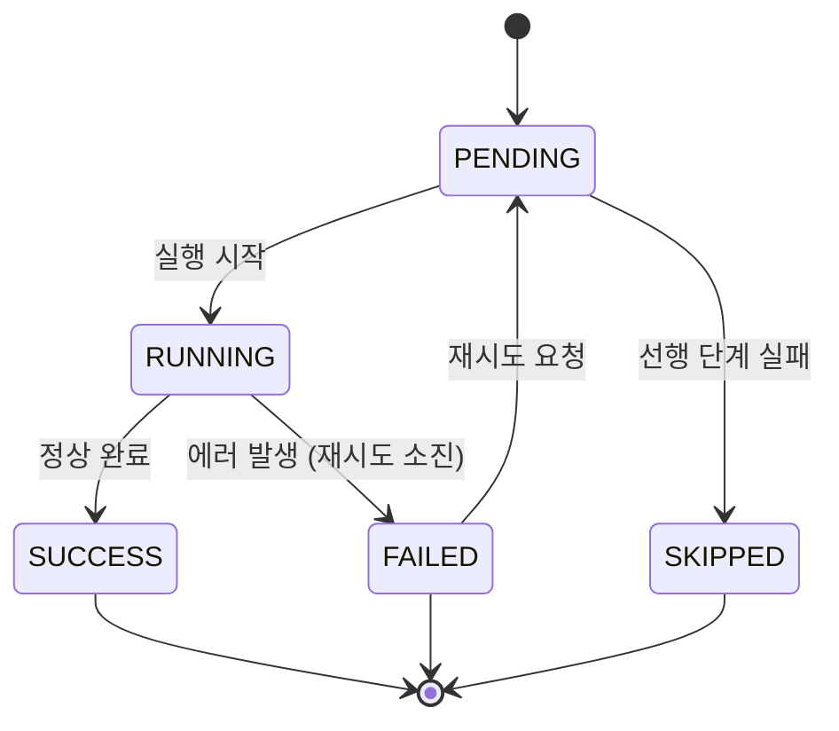
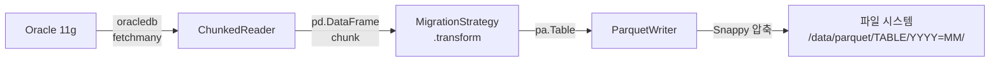
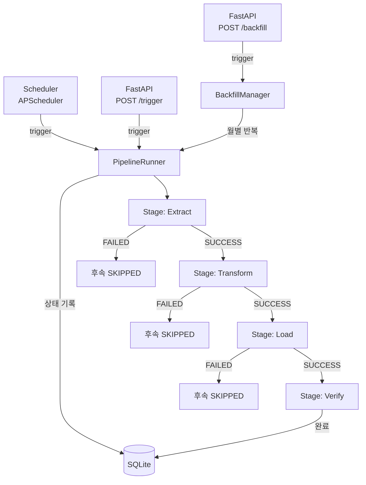

# Airflow Lite — 아키텍처 설계서

> 본 문서는 `requirements.md`(What)에 정의된 요구사항을 **어떻게** 구현할지 기술한다.
> AI 코드 생성 시 참조하는 설계 제약 문서이며, 요구사항 내용을 반복하지 않는다.

---

## 1. 설계 원칙

모든 설계 판단의 기준이 되는 5가지 원칙:

| # | 원칙 | 설명 | 근거 |
|---|------|------|------|
| P1 | **단일 프로세스** | 분산 없음. 스케줄러, API, 파이프라인 엔진이 하나의 프로세스에서 동작 | FR-08 제외, Windows 서비스 단일 관리 |
| P2 | **멱등성 우선** | 동일 `execution_date`로 재실행해도 결과가 동일 | FR-03, 백필 안전성 |
| P3 | **실패 격리** | 특정 단계의 실패가 이전 단계의 결과를 오염시키지 않음 | FR-01, 단계별 독립성 |
| P4 | **설정 주도** | 새 테이블 추가 = YAML 설정 변경만으로 가능 (코드 변경 불필요) | NFR-07 |
| P5 | **500MB 메모리 제약** | 모든 데이터 처리는 청크 기반 스트리밍으로 메모리 폭주 방지 | NFR-02, NFR-03 |

---

## 2. 프로젝트 구조

```
src/airflow_lite/
├── engine/              # Phase 1: 파이프라인 엔진 코어
│   ├── pipeline.py          # PipelineDefinition, PipelineRunner
│   ├── stage.py             # StageDefinition, StageState enum
│   ├── strategy.py          # MigrationStrategy ABC, Full/Incremental
│   ├── state_machine.py     # StageStateMachine
│   └── backfill.py          # BackfillManager
├── storage/             # Phase 1: 상태 저장소
│   ├── models.py            # 데이터 모델 (dataclass)
│   ├── repository.py        # PipelineRunRepository, StepRunRepository
│   └── database.py          # SQLite 연결 관리 (WAL 모드)
├── extract/             # Phase 1: Oracle 데이터 추출
│   ├── oracle_client.py     # Oracle 연결 (재시도 포함)
│   └── chunked_reader.py    # 청크 기반 커서 스트리밍
├── transform/           # Phase 1: 데이터 변환
│   └── parquet_writer.py    # Parquet 직렬화 (Snappy 압축)
├── config/              # Phase 1: 설정 관리
│   └── settings.py          # YAML 설정 로더
├── logging_config/      # Phase 1: 로깅
│   └── setup.py             # 로깅 설정 (TimedRotatingFileHandler)
├── scheduler/           # Phase 2: 스케줄러
│   └── scheduler.py         # APScheduler 통합
├── api/                 # Phase 2: API
│   ├── app.py               # FastAPI 앱 팩토리
│   ├── routes/              # 엔드포인트 모듈
│   │   ├── pipelines.py
│   │   └── backfill.py
│   └── schemas.py           # Pydantic 모델
├── alerting/            # Phase 2: 알림
│   ├── base.py              # AlertChannel ABC
│   ├── email.py             # EmailAlertChannel
│   └── webhook.py           # WebhookAlertChannel
└── service/             # Phase 2: Windows 서비스
    └── win_service.py       # pywin32 서비스 래퍼
```

패키지 엔트리포인트: `src/airflow_lite/__main__.py` (CLI 진입점)

---

## 3. 핵심 설계: 파이프라인 엔진 (Phase 1)

### 3.1 Strategy Pattern — 마이그레이션 전략

파이프라인은 항상 선형(Extract → Transform → Load → Verify)이므로 범용 DAG 엔진 대신 Strategy Pattern을 사용한다. [FR-01]

```python
# engine/strategy.py

class MigrationStrategy(ABC):
    """마이그레이션 전략 추상 클래스"""

    @abstractmethod
    def extract(self, context: StageContext) -> Iterator[pd.DataFrame]:
        """Oracle에서 청크 단위로 데이터 추출"""

    @abstractmethod
    def transform(self, chunk: pd.DataFrame, context: StageContext) -> pa.Table:
        """DataFrame을 PyArrow Table로 변환"""

    @abstractmethod
    def load(self, table: pa.Table, context: StageContext) -> int:
        """Parquet 파일로 저장, 처리 건수 반환"""

    @abstractmethod
    def verify(self, context: StageContext) -> bool:
        """소스-타겟 건수 일치 검증"""


class FullMigrationStrategy(MigrationStrategy):
    """전체 이관: 월별 파티션 전체를 덮어쓰기"""

class IncrementalMigrationStrategy(MigrationStrategy):
    """증분 이관: 마지막 이관 이후 변경분만 처리"""
```

**전략 선택**: YAML 설정의 `strategy` 필드 값에 따라 런타임에 결정.

```python
@dataclass
class StageContext:
    pipeline_name: str
    execution_date: date
    table_config: TableConfig
    run_id: str
    chunk_size: int
```

### 3.2 State Machine — 단계 상태 관리

각 단계(stage)의 실행 상태를 유한 상태 머신으로 관리한다. [FR-01]

```python
# engine/stage.py

class StageState(str, Enum):
    PENDING = "pending"
    RUNNING = "running"
    SUCCESS = "success"
    FAILED = "failed"
    SKIPPED = "skipped"
```

**상태 전이 다이어그램:**



```python
# engine/state_machine.py

class StageStateMachine:
    VALID_TRANSITIONS: dict[StageState, set[StageState]] = {
        StageState.PENDING: {StageState.RUNNING, StageState.SKIPPED},
        StageState.RUNNING: {StageState.SUCCESS, StageState.FAILED},
        StageState.FAILED:  {StageState.PENDING},
    }

    def transition(self, stage_run: StepRun, new_state: StageState) -> None:
        """상태 전이. 유효하지 않은 전이 시 InvalidTransitionError 발생.
        전이마다 SQLite에 즉시 저장하여 크래시 복구를 보장한다."""
```

**핵심 제약**: 모든 상태 전이는 `StageStateMachine.transition()`을 통해서만 수행하며, 전이 즉시 SQLite에 영속화한다. 이를 통해 프로세스 비정상 종료 후에도 마지막 상태부터 복구할 수 있다. [NFR-04]

### 3.3 PipelineRunner — 오케스트레이션

```python
# engine/pipeline.py

@dataclass
class StageDefinition:
    name: str
    callable: Callable[[StageContext], StageResult]
    retry_config: RetryConfig

@dataclass
class PipelineDefinition:
    name: str
    stages: list[StageDefinition]    # 순서대로 실행
    strategy: MigrationStrategy

class PipelineRunner:
    def __init__(
        self,
        pipeline: PipelineDefinition,
        run_repo: PipelineRunRepository,
        step_repo: StepRunRepository,
        state_machine: StageStateMachine,
    ): ...

    def run(self, execution_date: date, trigger_type: str = "scheduled") -> PipelineRun:
        """파이프라인 실행 메인 루프.

        1. PipelineRun 레코드 생성
        2. 각 StageDefinition을 순차 실행
        3. 단계 실패 시 후속 단계를 SKIPPED 처리
        4. 모든 단계 완료 후 PipelineRun 상태 갱신
        """
```

**`execution_date` 개념** (Airflow 차용): 파이프라인이 "어떤 날짜의 데이터를 처리하는가"를 나타내는 논리적 날짜. 실제 실행 시각과 무관하며, 동일 `execution_date`에 대한 재실행은 동일 결과를 보장한다 (멱등성, P2).

**단계 실패 처리**: 특정 단계가 FAILED 상태가 되면, 후속 모든 단계를 SKIPPED로 마킹하고 파이프라인을 FAILED로 종료한다. 이전 단계의 결과는 영향받지 않는다 (P3).

### 3.4 청크 기반 데이터 스트리밍

500MB 메모리 예산 내에서 대용량 테이블을 처리하기 위해 청크 기반 스트리밍을 사용한다. [NFR-02, NFR-03]

```python
# extract/chunked_reader.py

class ChunkedReader:
    def __init__(self, connection: oracledb.Connection, chunk_size: int):
        self.connection = connection
        self.chunk_size = chunk_size

    def read_chunks(
        self, query: str, params: dict | None = None
    ) -> Iterator[pd.DataFrame]:
        """fetchmany(chunk_size)로 청크 단위 읽기.
        각 청크는 즉시 Parquet row group으로 변환되어 메모리에서 해제."""
```

**chunk_size 산출 기준**: 테이블 행 평균 크기(bytes) 기반으로, 단일 청크가 메모리 예산의 60%를 넘지 않도록 설정. 나머지 40%는 Parquet 변환 및 런타임 오버헤드.

```
chunk_size = floor((500MB * 0.6) / avg_row_bytes)
```

YAML 설정에서 테이블별 `chunk_size`를 명시하되, 미지정 시 기본값 10,000을 사용.

**데이터 흐름**: Oracle 커서 → `fetchmany()` → `pd.DataFrame` → `pa.Table` → Parquet row group → 파일 시스템. 각 청크가 처리된 후 이전 청크의 DataFrame/Table 참조는 해제된다.

### 3.5 백필 (재처리) 설계

과거 데이터를 안전하게 재이관하는 메커니즘. [FR-03]

```python
# engine/backfill.py

class BackfillManager:
    def run_backfill(
        self,
        pipeline_name: str,
        start_date: date,
        end_date: date,
    ) -> list[PipelineRun]:
        """날짜 범위를 월 단위로 분할하여 순차 실행.

        1. start_date~end_date를 월 경계로 분할
        2. 각 월에 대해 PipelineRunner.run(execution_date=해당월)
        3. 결과를 리스트로 반환
        """
```

**파티셔닝 구조**:
```
/data/parquet/{TABLE_NAME}/YYYY={MM}/
    {TABLE_NAME}_{YYYY}_{MM}.parquet
```

**안전한 덮어쓰기 프로세스**:
1. 기존 파일을 `.bak` 확장자로 이동 (예: `*.parquet` → `*.parquet.bak`)
2. 새 Parquet 파일 생성
3. 검증(verify) 단계 성공 시 `.bak` 파일 삭제
4. 실패 시 `.bak` 파일 복원

### 3.6 재시도 및 에러 핸들링

Tenacity 라이브러리를 사용하여 단계(step) 단위로 재시도한다. [FR-02]

```python
# 재시도 적용 패턴 (Tenacity)
# 단계(step) 단위로 재시도하며, 설정 기반으로 횟수/간격을 제어한다.
# 구체적 데코레이터 파라미터는 task 문서 참조.
```

**ORACLE 환경 특화 재시도 대상 에러**:
| 에러 코드 | 설명 | 재시도 |
|-----------|------|--------|
| ORA-03113 | end-of-file on communication channel | O |
| ORA-03114 | not connected to ORACLE | O |
| ORA-12541 | TNS: no listener | O |
| NetworkError | 네트워크 타임아웃 | O |
| ORA-00001 | unique constraint violation | X |
| ORA-01400 | cannot insert NULL | X |

```python
# 재시도 가능 예외 정의
RETRYABLE_ORACLE_ERRORS = {3113, 3114, 12541, 12170, 12571}

class RetryableOracleError(Exception):
    """재시도 가능한 Oracle 에러를 래핑"""

class NonRetryableOracleError(Exception):
    """재시도 불가 에러 (데이터/로직 오류)"""
```

**재시도 범위**: 단계(step) 단위. 단계 내부에서 재시도가 소진되면 해당 단계를 FAILED로 전이하고, `on_failure_callback` 훅을 호출한다.

```python
@dataclass
class RetryConfig:
    max_attempts: int = 3
    min_wait_seconds: int = 4
    max_wait_seconds: int = 60
    on_failure_callback: Callable[[StageContext, Exception], None] | None = None
```

### 3.7 로깅 설계

구조화된 로깅과 실행 이력 저장을 분리하여 운영한다. [FR-06]

**파일 로깅**:
- `TimedRotatingFileHandler`: 일별 로테이션, 30일 보관
- 로거 네이밍 컨벤션: `airflow_lite.{module}.{pipeline}.{stage}`
  - 예: `airflow_lite.engine.production.extract`
- 로그 포맷: `%(asctime)s [%(levelname)s] %(name)s - %(message)s`
- 로그 경로: `logs/airflow_lite_{date}.log`

**SQLite 실행 이력**: `step_runs` 테이블에 시작/종료 시간, 처리 건수, 에러 메시지를 구조화하여 저장. 파일 로그와 별개로, API 조회 및 모니터링 UI 데이터 소스로 활용.

---

## 4. 상태 저장소: SQLite 스키마 (Phase 1)

SQLite를 메타데이터 및 실행 이력 저장소로 사용한다. 단일 서버/단일 프로세스 환경에서 별도 DB 서버는 불필요하며, WAL 모드로 API 읽기 동시성을 처리한다. [FR-06, NFR-04]

```sql
-- storage/schema.sql

PRAGMA journal_mode = WAL;
PRAGMA foreign_keys = ON;

CREATE TABLE IF NOT EXISTS pipeline_runs (
    id              TEXT PRIMARY KEY,     -- UUID
    pipeline_name   TEXT NOT NULL,
    execution_date  TEXT NOT NULL,        -- YYYY-MM-DD
    status          TEXT NOT NULL DEFAULT 'pending',
                    -- pending | running | success | failed
    started_at      TEXT,                 -- ISO 8601
    finished_at     TEXT,                 -- ISO 8601
    trigger_type    TEXT NOT NULL DEFAULT 'scheduled',
                    -- scheduled | manual | backfill
    created_at      TEXT NOT NULL DEFAULT (datetime('now')),

    UNIQUE(pipeline_name, execution_date, trigger_type)
);

CREATE TABLE IF NOT EXISTS step_runs (
    id                TEXT PRIMARY KEY,   -- UUID
    pipeline_run_id   TEXT NOT NULL REFERENCES pipeline_runs(id),
    step_name         TEXT NOT NULL,
    status            TEXT NOT NULL DEFAULT 'pending',
                      -- pending | running | success | failed | skipped
    started_at        TEXT,
    finished_at       TEXT,
    records_processed INTEGER DEFAULT 0,
    error_message     TEXT,
    retry_count       INTEGER DEFAULT 0,
    created_at        TEXT NOT NULL DEFAULT (datetime('now'))
);

CREATE INDEX IF NOT EXISTS idx_pipeline_runs_exec_date
    ON pipeline_runs(execution_date);
CREATE INDEX IF NOT EXISTS idx_pipeline_runs_status
    ON pipeline_runs(status);
CREATE INDEX IF NOT EXISTS idx_step_runs_pipeline_run
    ON step_runs(pipeline_run_id);
```

**Repository 패턴**:
```python
# storage/repository.py

class PipelineRunRepository:
    """pipeline_runs 테이블 CRUD. 조회 시 execution_date, pipeline_name 기반 필터링 지원."""

class StepRunRepository:
    """step_runs 테이블 CRUD. pipeline_run_id 기반 조회 지원."""
```

---

## 5. 설정 관리 (Phase 1)

YAML 포맷으로 운영자가 직접 수정 가능한 설정을 관리한다. [NFR-07, NFR-10]

```yaml
# config/pipelines.yaml — 파이프라인 정의 예시

oracle:
  host: ${ORACLE_HOST}              # 환경변수 참조 [NFR-10]
  port: ${ORACLE_PORT}
  service_name: ${ORACLE_SERVICE}
  user: ${ORACLE_USER}
  password: ${ORACLE_PASSWORD}
  oracle_home: "D:/app/user/product/11.2.0/dbhome_1"  # oracledb thick mode용 Oracle Client 경로

storage:
  parquet_base_path: "D:/data/parquet"
  sqlite_path: "D:/data/airflow_lite.db"
  log_path: "D:/data/logs"

defaults:
  chunk_size: 10000
  retry:
    max_attempts: 3
    min_wait_seconds: 4
    max_wait_seconds: 60
  parquet:
    compression: "snappy"

pipelines:
  - name: "production_log"
    table: "PRODUCTION_LOG"
    partition_column: "LOG_DATE"          # 월별 파티셔닝 기준 컬럼
    strategy: "full"                      # full | incremental
    chunk_size: 20000                     # 테이블별 오버라이드
    schedule: "0 2 * * *"                 # 매일 02:00
    columns:                              # 선택적 컬럼 지정 (미지정 시 전체)
      - "LOG_ID"
      - "PRODUCT_CODE"
      - "LOG_DATE"
      - "QUANTITY"
      - "STATUS"

  - name: "equipment_status"
    table: "EQUIPMENT_STATUS"
    partition_column: "STATUS_DATE"
    strategy: "incremental"
    schedule: "0 */6 * * *"              # 6시간 간격
    incremental_key: "UPDATED_AT"        # 증분 기준 컬럼
```

```python
# config/settings.py

class Settings:
    """YAML 설정 로더. 환경변수 ${VAR} 참조를 자동 치환한다."""

    @classmethod
    def load(cls, config_path: str) -> "Settings": ...

    oracle: OracleConfig
    storage: StorageConfig
    defaults: DefaultConfig
    pipelines: list[PipelineConfig]
```

**환경변수 치환**: YAML 내 `${VAR_NAME}` 패턴을 `os.environ`에서 조회하여 치환. 미설정 시 시작 단계에서 명확한 에러 메시지와 함께 실패.

---

## 6. 스케줄러 설계 (Phase 2)

APScheduler `BackgroundScheduler`로 주기적 파이프라인 실행을 관리한다. [FR-04]

```python
# scheduler/scheduler.py

class PipelineScheduler:
    """APScheduler BackgroundScheduler를 래핑하여 파이프라인 스케줄링을 관리한다.

    설계 제약:
    - SQLite JobStore 사용 (상태 영속화)
    - 동일 파이프라인 동시 실행 방지 (max_instances=1)
    - misfire_grace_time으로 놓친 실행 처리
    """

    def register_pipelines(self) -> None:
        """설정의 모든 파이프라인을 스케줄러에 등록."""

    def start(self) -> None: ...
    def shutdown(self, wait: bool = True) -> None:
        """Graceful shutdown: 실행 중인 작업 완료 대기 후 종료."""
```

**misfire 처리**: 서버 다운타임 동안 놓친 실행은 `misfire_grace_time`(1시간) 이내면 재시작 시 즉시 실행. 초과 시 건너뛰고 다음 스케줄 대기.

---

## 7. API 설계 (Phase 2)

FastAPI 기반 REST API로 수동 트리거, 백필 요청, 상태 조회를 제공한다. [FR-04, FR-05, NFR-11]

### 엔드포인트

| Method | Path | 설명 |
|--------|------|------|
| `POST` | `/api/v1/pipelines/{name}/trigger` | 수동 즉시 실행 |
| `POST` | `/api/v1/pipelines/{name}/backfill` | 백필 요청 (start_date, end_date) |
| `GET`  | `/api/v1/pipelines` | 파이프라인 목록 조회 |
| `GET`  | `/api/v1/pipelines/{name}/runs` | 실행 이력 조회 (pagination) |
| `GET`  | `/api/v1/pipelines/{name}/runs/{run_id}` | 실행 상세 (단계별 상태 포함) |

### 앱 팩토리

```python
# api/app.py

def create_app(settings: Settings) -> FastAPI:
    """FastAPI 앱 팩토리.

    설계 제약:
    - CORS: 사내망 IP 대역만 허용 [NFR-11]
    - API prefix: /api/v1
    """
```

### Request/Response 스키마

```python
# api/schemas.py

class TriggerRequest(BaseModel):
    execution_date: date | None = None    # 미지정 시 오늘

class BackfillRequest(BaseModel):
    start_date: date
    end_date: date

class PipelineRunResponse(BaseModel):
    id: str
    pipeline_name: str
    execution_date: date
    status: str
    started_at: datetime | None
    finished_at: datetime | None
    trigger_type: str
    steps: list["StepRunResponse"]

class StepRunResponse(BaseModel):
    step_name: str
    status: str
    started_at: datetime | None
    finished_at: datetime | None
    records_processed: int
    error_message: str | None
    retry_count: int
```

**내부망 제한** [NFR-11]: uvicorn 바인딩 주소를 `0.0.0.0` 대신 사내 IP로 지정하거나, 방화벽 규칙으로 외부 접근을 차단한다. CORS `allow_origins`에 허용 IP 대역만 설정.

---

## 8. 알림 설계 (Phase 2)

파이프라인 실패/완료 시 알림을 발송한다. [FR-07]

```python
# alerting/base.py

class AlertChannel(ABC):
    @abstractmethod
    def send(self, alert: AlertMessage) -> None: ...

@dataclass
class AlertMessage:
    pipeline_name: str
    execution_date: date
    status: str              # failed | success
    error_message: str | None
    timestamp: datetime
```

**구현체**:

| 채널 | 클래스 | 전송 방식 |
|------|--------|-----------|
| 이메일 | `EmailAlertChannel` | `smtplib.SMTP` (사내 SMTP 서버) |
| 웹훅 | `WebhookAlertChannel` | `httpx.post()` (사내 메신저 웹훅 URL) |

**알림 트리거 조건**:
- 재시도 소진 후 최종 실패 (`on_failure_callback` 경유)
- 파이프라인 전체 완료 (선택적, 설정 기반)
- 파이프라인 전체 실패

**설정**:
```yaml
alerting:
  channels:
    - type: "email"
      smtp_host: "mail.internal.company.com"
      smtp_port: 25
      recipients: ["ops-team@company.com"]
    - type: "webhook"
      url: "https://messenger.internal/webhook/xxx"
  triggers:
    on_failure: true
    on_success: false
```

---

## 9. Windows 서비스 (Phase 2)

pywin32 `ServiceFramework`로 단일 프로세스를 Windows 서비스로 등록한다. [NFR-06]

```python
# service/win_service.py

class AirflowLiteService(win32serviceutil.ServiceFramework):
    _svc_name_ = "AirflowLiteService"
    _svc_display_name_ = "Airflow Lite Pipeline Service"
    _svc_description_ = "데이터 파이프라인 엔진"

    def SvcDoRun(self):
        """서비스 시작.
        1. Settings 로드
        2. PipelineScheduler 시작 (APScheduler)
        3. uvicorn을 별도 스레드에서 실행 (FastAPI)
        4. 종료 이벤트 대기
        """

    def SvcStop(self):
        """Graceful shutdown.
        1. uvicorn 서버 종료
        2. PipelineScheduler shutdown(wait=True)
        3. 실행 중인 파이프라인 완료 대기 (타임아웃 적용)
        """
```

**단일 프로세스 공존 구조** (P1):
- 메인 스레드: APScheduler `BackgroundScheduler`
- 별도 스레드: `uvicorn.run()` (FastAPI)
- 둘 다 같은 프로세스 내에서 동작하며, 서버 재부팅 시 Windows 서비스 관리자가 자동 시작

**서비스 등록/제거 CLI**:
```bash
python -m airflow_lite service install    # 서비스 등록 (자동 시작)
python -m airflow_lite service remove     # 서비스 제거
python -m airflow_lite service start      # 서비스 시작
python -m airflow_lite service stop       # 서비스 중지
```

---

## 10. 모니터링 UI 연동 (Phase 3)

React 프론트엔드는 별도 프로젝트로 개발하며, 본 문서에서는 API 계약만 정의한다. [FR-05]

### 데이터 조회 전략

- **기본**: 폴링 (10초 간격, `GET /api/v1/pipelines/{name}/runs`)
- **향후**: WebSocket 엔드포인트 (`/ws/pipelines/{name}/status`)로 실시간 업데이트 (Phase 3 후반)

### 프론트엔드 데이터 포맷 규약

**AG Grid 이력 조회 응답** (`GET /api/v1/pipelines/{name}/runs`):
```json
{
  "items": [
    {
      "id": "uuid",
      "pipeline_name": "production_log",
      "execution_date": "2026-03-17",
      "status": "success",
      "started_at": "2026-03-17T02:00:01",
      "finished_at": "2026-03-17T02:15:32",
      "trigger_type": "scheduled",
      "steps": [
        {"step_name": "extract", "status": "success", "records_processed": 150000},
        {"step_name": "transform", "status": "success", "records_processed": 150000},
        {"step_name": "load", "status": "success", "records_processed": 150000},
        {"step_name": "verify", "status": "success", "records_processed": 0}
      ]
    }
  ],
  "total": 120,
  "page": 1,
  "page_size": 50
}
```

**Recharts 통계 데이터** (별도 집계 엔드포인트, Phase 3에서 추가):
```json
{
  "daily_stats": [
    {"date": "2026-03-17", "success": 5, "failed": 1, "avg_duration_seconds": 920}
  ]
}
```

---

## 11. 데이터 흐름 다이어그램

### 11.1 데이터 흐름



### 11.2 제어 흐름



---

## 12. 의존성 및 버전 제약

| 패키지 | 용도 | 최소 버전 | Phase |
|--------|------|-----------|-------|
| `oracledb` | Oracle 11g 연결 (thick mode) | 1.3+ | 1 |
| `pyarrow` | Parquet 읽기/쓰기 | 14.0+ | 1 |
| `pandas` | 데이터 청크 처리 | 2.1+ | 1 |
| `tenacity` | 재시도 로직 | 8.2+ | 1 |
| `pyyaml` | YAML 설정 파싱 | 6.0+ | 1 |
| `apscheduler` | 스케줄링 | 3.10+ | 2 |
| `fastapi` | REST API | 0.110+ | 2 |
| `uvicorn` | ASGI 서버 | 0.27+ | 2 |
| `pydantic` | 데이터 검증 | 2.6+ | 2 |
| `httpx` | 웹훅 HTTP 클라이언트 | 0.27+ | 2 |
| `pywin32` | Windows 서비스 | 306+ | 2 |

**cx_Oracle 미지원 안내**: cx_Oracle은 Python 3.14에서 설치 불가(개발 공식 종료). Oracle 공식 후속 패키지인 `oracledb`(python-oracledb)를 사용한다. Oracle 11g 연결에는 **thick mode** 활성화가 필요하며, Oracle Instant Client(또는 Oracle Database Home) 경로를 `oracle_home` 설정에 지정해야 한다. `oracledb.init_oracle_client(lib_dir=...)` 호출로 프로세스 시작 시 자동 초기화된다.

---

## 핵심 설계 판단 기록

| # | 판단 | 선택 | 대안 | 근거 |
|---|------|------|------|------|
| D1 | 파이프라인 실행 모델 | Strategy Pattern + State Machine | 범용 DAG 엔진 | 파이프라인이 항상 선형(E→T→L→V)이므로 DAG는 과도한 추상화 |
| D2 | 상태 저장소 | SQLite (WAL 모드) | PostgreSQL, 별도 DB 서버 | 단일 서버/단일 프로세스에서 운영 오버헤드 제로. WAL로 API 읽기 동시성 처리 |
| D3 | 설정 포맷 | YAML | Python 코드 (Airflow DAG 방식) | 운영자가 코드 수정 없이 새 테이블을 추가할 수 있도록 (NFR-07) |
| D4 | 프로세스 구조 | 단일 프로세스 (APScheduler + FastAPI 스레드) | 멀티 프로세스, supervisord | Windows 서비스 하나로 관리. uvicorn을 스레드로 실행 |
| D5 | 파티셔닝 단위 | 월별 | 일별, 연별 | 생산 보고 주기 일치, 백필 단위 일치, 파일 크기 관리 적절 |

---

## 변경 이력

| 날짜 | 버전 | 내용 |
|------|------|------|
| 2026-03-17 | 0.1 | 초안 작성 |
