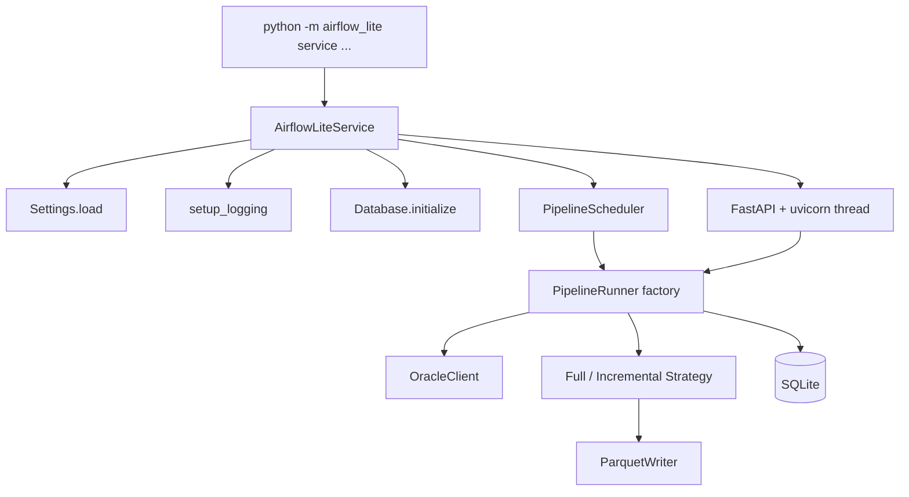

# Airflow Lite 아키텍처

이 문서는 현재 저장소의 실제 구현을 기준으로 작성했다. 초기에 작성된 목표 설계가 아니라, 지금 코드가 어떤 식으로 조립되고 동작하는지 나중에 다시 확인할 수 있도록 정리한 참고 문서다.

## 1. 시스템 개요

Airflow Lite 는 Oracle 11g 데이터를 Parquet 로 이관하는 단일 프로세스 기반 서비스다. 런타임 조립은 대부분 [`src/airflow_lite/service/win_service.py`](../../src/airflow_lite/service/win_service.py) 에 모여 있다.

핵심 구성은 아래와 같다.

- 설정: [`src/airflow_lite/config/settings.py`](../../src/airflow_lite/config/settings.py)
- 실행 엔진: [`src/airflow_lite/engine/`](../../src/airflow_lite/engine/)
- Oracle 추출: [`src/airflow_lite/extract/`](../../src/airflow_lite/extract/)
- Parquet 적재: [`src/airflow_lite/transform/parquet_writer.py`](../../src/airflow_lite/transform/parquet_writer.py)
- 메타데이터 저장: [`src/airflow_lite/storage/`](../../src/airflow_lite/storage/)
- API: [`src/airflow_lite/api/`](../../src/airflow_lite/api/)
- 스케줄러: [`src/airflow_lite/scheduler/scheduler.py`](../../src/airflow_lite/scheduler/scheduler.py)
- Windows 서비스 진입점: [`src/airflow_lite/__main__.py`](../../src/airflow_lite/__main__.py)

## 2. 런타임 토폴로지

현재 운영 경로는 Windows 서비스 중심이다.



중요한 점:

- 스케줄러와 API 서버는 같은 프로세스 안에 있다.
- FastAPI 는 `uvicorn.Server` 를 별도 스레드에서 실행한다.
- 파이프라인 인스턴스는 서비스가 보유한 factory 가 요청할 때마다 생성한다.
- Oracle 연결, ParquetWriter, StageStateMachine, AlertManager 는 factory 내부 공유 인프라로 재사용된다.

## 3. 패키지 구조

```text
src/airflow_lite/
├── __main__.py
├── alerting/
│   ├── base.py
│   ├── email.py
│   └── webhook.py
├── api/
│   ├── app.py
│   ├── schemas.py
│   └── routes/
│       ├── pipelines.py
│       └── backfill.py
├── config/
│   └── settings.py
├── engine/
│   ├── backfill.py
│   ├── pipeline.py
│   ├── stage.py
│   ├── state_machine.py
│   └── strategy.py
├── extract/
│   ├── chunked_reader.py
│   └── oracle_client.py
├── logging_config/
│   └── setup.py
├── scheduler/
│   └── scheduler.py
├── service/
│   └── win_service.py
├── storage/
│   ├── database.py
│   ├── models.py
│   ├── repository.py
│   └── schema.sql
└── transform/
    └── parquet_writer.py
```

## 4. 설정 모델

설정 파일은 기본적으로 `config/pipelines.yaml` 이며, [`Settings.load()`](../../src/airflow_lite/config/settings.py) 가 파싱한다.

### 4.1 지원 섹션

- `oracle`
- `storage`
- `defaults`
- `pipelines`
- `api`
- `alerting`

### 4.2 구현 포인트

- 문자열의 `${VAR_NAME}` 패턴은 재귀적으로 환경변수 치환한다.
- 일부 숫자 필드는 문자열이어도 정수로 강제 변환한다.
- `api`, `alerting` 섹션이 없으면 기본 dataclass 값으로 채운다.
- 알림 채널 타입은 현재 `email`, `webhook` 두 개만 허용한다.

### 4.3 현재 설정 객체

`settings.py` 에 정의된 주요 dataclass:

- `OracleConfig`
- `StorageConfig`
- `RetryDefaults`
- `ParquetDefaults`
- `DefaultConfig`
- `PipelineConfig`
- `ApiConfig`
- `EmailChannelConfig`
- `WebhookChannelConfig`
- `AlertingTriggersConfig`
- `AlertingConfig`

`PipelineConfig` 필드:

```python
name: str
table: str
partition_column: str
strategy: str
schedule: str
chunk_size: int | None = None
columns: list[str] | None = None
incremental_key: str | None = None
```

## 5. 실행 엔진

### 5.1 핵심 타입

엔진 계층의 주요 타입은 아래 파일에 있다.

- [`engine/stage.py`](../../src/airflow_lite/engine/stage.py)
- [`engine/pipeline.py`](../../src/airflow_lite/engine/pipeline.py)
- [`engine/state_machine.py`](../../src/airflow_lite/engine/state_machine.py)

주요 개념:

- `StageState`: `pending`, `running`, `success`, `failed`, `skipped`
- `StageContext`: `pipeline_name`, `execution_date`, `table_config`, `run_id`, `chunk_size`
- `StageDefinition`: 이름, 실행 callable, retry 설정
- `PipelineDefinition`: 이름, stage 목록, strategy, table_config, chunk_size
- `PipelineRunner`: 파이프라인 실행기

### 5.2 실제 stage 구성

초기 설계 문서와 달리 현재 서비스가 만드는 stage 는 4단계가 아니라 2단계다.

1. `extract_transform_load`
2. `verify`

`extract_transform_load` 단계 내부에서 아래 작업을 모두 수행한다.

1. `strategy.extract(context)` 로 청크 조회
2. 각 청크를 `strategy.transform(chunk, context)` 로 Arrow Table 변환
3. 각 Table 을 `strategy.load(table, context)` 로 적재
4. 전체 적재 건수를 `StageResult.records_processed` 에 누적

`verify` 단계는 마지막에 `strategy.verify(context)` 만 호출한다.

### 5.3 상태 전이

유효한 전이는 [`StageStateMachine.VALID_TRANSITIONS`](../../src/airflow_lite/engine/state_machine.py) 에 고정되어 있다.

```text
pending -> running
pending -> skipped
running -> success
running -> failed
failed  -> pending
```

`StageStateMachine.transition()` 은 전이 직후 `StepRunRepository.update_status()` 를 호출해 SQLite 에 즉시 반영한다.

### 5.4 실패 처리

`PipelineRunner.run()` 동작 요약:

1. 같은 `pipeline_name + execution_date` 의 성공 실행이 있으면 기존 성공 실행 반환
2. 없으면 `pipeline_runs` 레코드 생성
3. 각 stage 마다 `step_runs` 레코드 생성
4. 실패가 발생하면 이후 stage 는 `skipped`
5. 마지막에 파이프라인 상태를 `success` 또는 `failed` 로 마감

구현상 멱등성은 "성공 실행 재사용" 으로 정의되어 있다. 실패 실행은 같은 날짜라도 재시도할 수 있다.

### 5.5 재시도

재시도는 Tenacity 를 사용한다. 적용 범위는 stage 단위다.

ETL 단계에서 사용되는 기본 설정은 `settings.defaults.retry` 에서 온다.

```python
retry(
    stop=stop_after_attempt(max_attempts),
    wait=wait_exponential(min=min_wait_seconds, max=max_wait_seconds),
    retry=retry_if_exception_type(RETRYABLE_EXCEPTIONS),
    before_sleep=...
)
```

현재 재시도 대상 예외:

- `RetryableOracleError`
- `ConnectionError`
- `TimeoutError`

재시도 중에는 `step_runs.retry_count` 가 업데이트된다.

`verify` 단계는 현재 `max_attempts=1` 로 생성되므로 재시도하지 않는다.

## 6. 마이그레이션 전략

전략 구현은 [`src/airflow_lite/engine/strategy.py`](../../src/airflow_lite/engine/strategy.py) 에 있다.

### 6.1 FullMigrationStrategy

동작 방식:

- `partition_column` 기준으로 실행 월 전체를 조회한다.
- 첫 청크 적재 전 기존 월 파티션 Parquet 를 `.bak` 로 rename 한다.
- 첫 청크는 base 파일에 쓰고, 이후 청크는 같은 파일에 row group append 한다.
- 검증은 `SELECT COUNT(*) FROM (...)` 결과와 Parquet 총 row 수를 비교한다.

쿼리 형태:

```sql
SELECT {columns}
FROM {table}
WHERE {partition_column} >= DATE 'YYYY-MM-01'
  AND {partition_column} < DATE 'NEXT_MONTH_01'
```

적재 모드:

- 첫 청크: `append=False`, `append_mode="single_file"`
- 이후 청크: `append=True`, `append_mode="single_file"`

주의:

- 현재 구현은 기존 파일을 `.bak` 로 남기지만, verify 실패 시 `.bak` 자동 복원까지는 연결돼 있지 않다.

### 6.2 IncrementalMigrationStrategy

동작 방식:

- `incremental_key` 기준으로 `execution_date` 당일 범위만 조회한다.
- 적재는 항상 append 로 수행한다.
- 월별 디렉터리 안에 base 파일 또는 `.partNNNNN.parquet` 파일이 추가될 수 있다.
- 검증은 "이번 실행에서 적재한 row 수 <= 파티션 전체 row 수" 조건을 사용한다.

쿼리 형태:

```sql
SELECT {columns}
FROM {table}
WHERE {incremental_key} >= DATE 'YYYY-MM-DD'
  AND {incremental_key} < DATE 'NEXT_DAY'
```

증분 적재는 일 단위 조회지만 저장 경로는 월 단위 파티션을 계속 사용한다.

## 7. Oracle 추출 계층

### 7.1 OracleClient

[`extract/oracle_client.py`](../../src/airflow_lite/extract/oracle_client.py) 의 역할:

- `oracledb.makedsn()` 으로 DSN 생성
- 연결 객체 캐시 및 `ping()` 기반 생존 확인
- 필요 시 재연결
- thick mode 초기화 시도
- Oracle 오류를 재시도 가능/불가 예외로 분류

재시도 가능 코드:

```text
3113, 3114, 12541, 12170, 12571
```

### 7.2 ChunkedReader

[`extract/chunked_reader.py`](../../src/airflow_lite/extract/chunked_reader.py) 는 커서에서 `fetchmany(chunk_size)` 로 DataFrame 을 순차 생성한다.

데이터 흐름:

```text
Oracle cursor -> fetchmany() -> pandas.DataFrame -> caller yield
```

이 계층은 변환이나 적재를 몰라도 되고, 단순히 읽기 스트리밍만 담당한다.

## 8. Parquet 적재 계층

[`transform/parquet_writer.py`](../../src/airflow_lite/transform/parquet_writer.py) 의 책임:

- 월 파티션 경로 생성
- `pyarrow.parquet.write_table()` 또는 `ParquetWriter` 사용
- append 시 sidecar 파일 또는 single file row group append 지원
- 기존 파일 백업
- 월 파티션 row count 조회

### 8.1 경로 규칙

```text
{base_path}/{TABLE_NAME}/year={YYYY}/month={MM}/
```

대표 파일명:

```text
{TABLE_NAME}_{YYYY}_{MM}.parquet
```

증분 append 예:

```text
{TABLE_NAME}_{YYYY}_{MM}.part00001.parquet
```

### 8.2 append 모드

- `append_mode="single_file"`: 하나의 parquet 파일에 row group 추가
- `append_mode="sidecar"`: 추가 part 파일 생성

현재 사용 방식:

- `full`: `single_file`
- `incremental`: 기본값 `sidecar`

## 9. 메타데이터 저장소

### 9.1 DB 초기화

[`storage/database.py`](../../src/airflow_lite/storage/database.py) 는 SQLite 연결 시 아래 pragma 를 적용한다.

- `PRAGMA journal_mode = WAL`
- `PRAGMA foreign_keys = ON`

초기화 시 [`storage/schema.sql`](../../src/airflow_lite/storage/schema.sql) 을 실행한 뒤, 예전 스키마의 전체 유니크 제약을 부분 유니크 인덱스로 바꾸는 마이그레이션을 수행한다.

### 9.2 현재 스키마

```sql
CREATE TABLE pipeline_runs (
    id TEXT PRIMARY KEY,
    pipeline_name TEXT NOT NULL,
    execution_date TEXT NOT NULL,
    status TEXT NOT NULL DEFAULT 'pending',
    started_at TEXT,
    finished_at TEXT,
    trigger_type TEXT NOT NULL DEFAULT 'scheduled',
    created_at TEXT NOT NULL DEFAULT (datetime('now'))
);

CREATE TABLE step_runs (
    id TEXT PRIMARY KEY,
    pipeline_run_id TEXT NOT NULL REFERENCES pipeline_runs(id),
    step_name TEXT NOT NULL,
    status TEXT NOT NULL DEFAULT 'pending',
    started_at TEXT,
    finished_at TEXT,
    records_processed INTEGER DEFAULT 0,
    error_message TEXT,
    retry_count INTEGER DEFAULT 0,
    created_at TEXT NOT NULL DEFAULT (datetime('now'))
);
```

핵심 인덱스:

- `idx_pipeline_runs_exec_date`
- `idx_pipeline_runs_status`
- `idx_pipeline_runs_success_unique`
- `idx_step_runs_pipeline_run`

`idx_pipeline_runs_success_unique` 는 아래 조건을 갖는다.

```sql
CREATE UNIQUE INDEX IF NOT EXISTS idx_pipeline_runs_success_unique
ON pipeline_runs(pipeline_name, execution_date, trigger_type)
WHERE status = 'success';
```

즉, 실패 실행은 같은 날짜에 여러 번 존재할 수 있고, 성공 실행만 유일해야 한다.

### 9.3 Repository 계층

[`storage/repository.py`](../../src/airflow_lite/storage/repository.py) 는 dataclass 모델과 SQLite row 사이를 매핑한다.

주요 메서드:

- `PipelineRunRepository.create()`
- `PipelineRunRepository.find_by_id()`
- `PipelineRunRepository.find_by_pipeline_paginated()`
- `PipelineRunRepository.find_latest_success_by_execution_date()`
- `StepRunRepository.create()`
- `StepRunRepository.update_status()`
- `StepRunRepository.find_by_pipeline_run()`

## 10. 스케줄러

[`scheduler/scheduler.py`](../../src/airflow_lite/scheduler/scheduler.py) 는 APScheduler `BackgroundScheduler` 를 감싼 얇은 래퍼다.

설정 특징:

- JobStore: `SQLAlchemyJobStore(sqlite:///{sqlite_path})`
- `coalesce=True`
- `max_instances=1`
- `misfire_grace_time=3600`

각 파이프라인의 `schedule` 문자열은 `CronTrigger.from_crontab()` 으로 등록된다.

스케줄 실행 시 동작:

1. `runner_factory(pipeline_name)` 호출
2. `runner.run(execution_date=date.today(), trigger_type="scheduled")`
3. 예외는 로깅하고 APScheduler 밖으로 전파하지 않음

## 11. API

API 앱 생성은 [`api/app.py`](../../src/airflow_lite/api/app.py) 의 `create_app()` 가 맡는다.

### 11.1 app.state 주입

`create_app()` 는 아래 객체를 `app.state` 에 넣는다.

- `settings`
- `runner_map`
- `backfill_map`
- `run_repo`
- `step_repo`

라우터는 DI 시스템 대신 이 `app.state` 를 읽는다.

### 11.2 CORS

`settings.api.allowed_origins` 를 exact origin 과 wildcard regex 로 분해해 `CORSMiddleware` 에 설정한다.

예:

- `http://10.0.0.*`
- `http://192.168.1.*`

### 11.3 엔드포인트

#### pipelines 라우터

- `POST /api/v1/pipelines/{name}/trigger`
- `GET /api/v1/pipelines`
- `GET /api/v1/pipelines/{name}/runs`
- `GET /api/v1/pipelines/{name}/runs/{run_id}`

#### backfill 라우터

- `POST /api/v1/pipelines/{name}/backfill`

### 11.4 응답 특성

- 실행 이력 목록은 `{items, total, page, page_size}` 형태
- 실행 상세와 수동 실행 응답에는 `steps` 배열이 포함
- 백필 응답은 월별 실행 결과 리스트

## 12. 백필

[`engine/backfill.py`](../../src/airflow_lite/engine/backfill.py) 의 `BackfillManager` 는 날짜 범위를 월 시작일 목록으로 분해한 후 `PipelineRunner.run(..., trigger_type="backfill")` 을 반복 호출한다.

예:

```text
2026-01-15 ~ 2026-04-10
-> [2026-01-01, 2026-02-01, 2026-03-01, 2026-04-01]
```

`BackfillManager` 안에는 `backup_existing()`, `remove_backup()`, `restore_backup()` 유틸리티도 있지만, 현재 서비스 경로에서는 full migration 검증 실패 시 자동 호출되지는 않는다.

## 13. 알림

알림 계층은 [`alerting/base.py`](../../src/airflow_lite/alerting/base.py) 를 중심으로 구성된다.

구성요소:

- `AlertMessage`
- `AlertChannel`
- `AlertManager`
- `EmailAlertChannel`
- `WebhookAlertChannel`

지원 채널:

- 이메일: `smtplib.SMTP`
- 웹훅: `httpx.Client.post()`

### 13.1 현재 서비스에서의 실제 연결 방식

`AirflowLiteService._create_runner_factory()` 가 `AlertManager` 를 만들고, ETL stage 의 `RetryConfig.on_failure_callback` 에만 연결한다.

따라서 현재 런타임에서는 다음만 자동 발송된다.

- `extract_transform_load` 단계가 재시도 소진 후 실패했을 때

현재 자동 발송되지 않는 경우:

- `verify` 단계 실패
- 파이프라인 성공 완료

`AlertManager` 와 설정 모델은 성공 알림을 지원하지만, 서비스 조립 경로에서 실제로 호출하지는 않는다.

## 14. 로깅

[`logging_config/setup.py`](../../src/airflow_lite/logging_config/setup.py) 는 `airflow_lite` 루트 로거에 핸들러를 등록한다.

특징:

- `TimedRotatingFileHandler`
- 자정 기준 일 단위 로테이션
- `backupCount=30`
- 파일명 기본값: `airflow_lite.log`
- suffix: `%Y-%m-%d`
- 콘솔 핸들러도 함께 등록

포맷:

```text
%(asctime)s [%(levelname)s] %(name)s - %(message)s
```

주의:

- 현재 구현은 핸들러 중복 등록 방지 로직이 없다. 같은 프로세스에서 `setup_logging()` 을 반복 호출하면 핸들러가 누적될 수 있다.

## 15. 서비스 수명주기

Windows 서비스 클래스는 [`service/win_service.py`](../../src/airflow_lite/service/win_service.py) 의 `AirflowLiteService` 이다.

### 15.1 시작 시퀀스

1. `Settings.load("config/pipelines.yaml")`
2. `setup_logging(settings.storage.log_path)`
3. `Database.initialize()`
4. `run_repo`, `step_repo` 생성
5. `runner_factory` 생성
6. `PipelineScheduler.register_pipelines()`
7. `PipelineScheduler.start()`
8. FastAPI 앱 생성
9. `uvicorn.Server` 를 daemon thread 로 시작
10. 서비스 stop event 대기

### 15.2 종료 시퀀스

1. 서비스 상태를 `SERVICE_STOP_PENDING` 으로 변경
2. `uvicorn_server.should_exit = True`
3. `scheduler.shutdown(wait=True)`
4. API thread `join(timeout=30)`
5. stop event signal

## 16. CLI

패키지 엔트리포인트는 [`__main__.py`](../../src/airflow_lite/__main__.py) 에서 처리한다.

현재 지원 명령은 하나다.

```bash
python -m airflow_lite service install
python -m airflow_lite service remove
python -m airflow_lite service start
python -m airflow_lite service stop
```

즉, 현재 저장소에는 별도 `run`, `api`, `scheduler`, `backfill` CLI 명령은 없다.

## 17. 현재 구현 기준 주의사항

나중에 코드를 다시 볼 때 혼동하기 쉬운 부분만 따로 남긴다.

- 문서상 "Extract -> Transform -> Load -> Verify" 라는 개념은 있지만, 실제 stage 는 2개다.
- full migration 은 `.bak` 백업을 만들지만 verify 실패 후 자동 복원 로직은 연결돼 있지 않다.
- incremental verify 는 "이번 실행 적재 수 <= 월 파티션 총 row 수" 검증이라, full strategy 의 정확한 source-target 동등성 검증과 다르다.
- 알림 인프라는 범용적으로 보이지만 실제 서비스 경로에서는 ETL 실패만 자동 통지한다.
- CLI 는 Windows 서비스 중심이며, 비서비스 모드 실행 진입점은 아직 없다.

## 18. 참고 테스트

현재 아키텍처를 이해할 때 같이 보면 좋은 테스트:

- [`tests/test_engine.py`](../../tests/test_engine.py)
- [`tests/test_extract.py`](../../tests/test_extract.py)
- [`tests/test_storage.py`](../../tests/test_storage.py)
- [`tests/test_api.py`](../../tests/test_api.py)
- [`tests/test_scheduler.py`](../../tests/test_scheduler.py)
- [`tests/test_service.py`](../../tests/test_service.py)
- [`tests/integration/test_pipeline_runner_e2e.py`](../../tests/integration/test_pipeline_runner_e2e.py)
- [`tests/integration/test_full_migration.py`](../../tests/integration/test_full_migration.py)
- [`tests/integration/test_incremental_migration.py`](../../tests/integration/test_incremental_migration.py)
