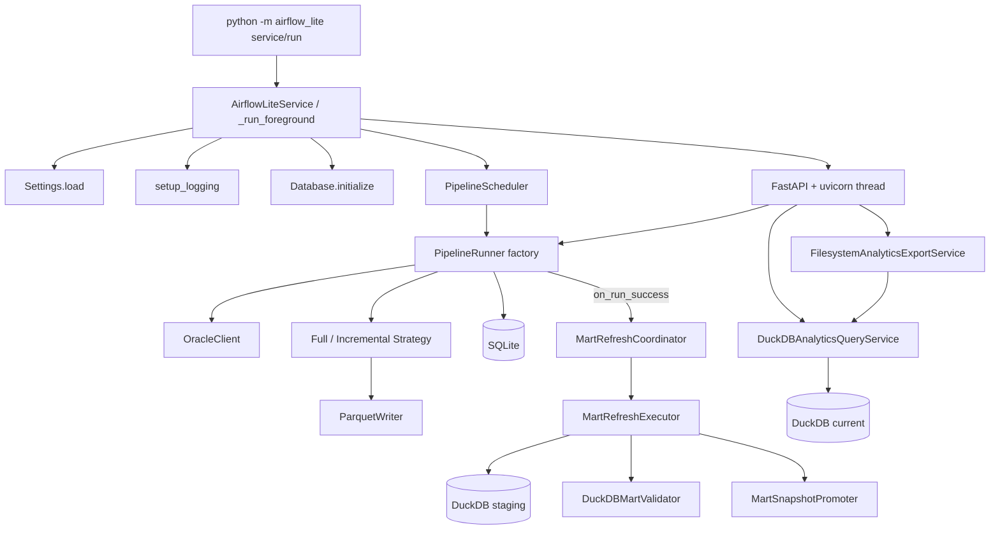

# Airflow Lite 아키텍처

이 문서는 현재 저장소의 실제 구현을 기준으로 작성했다. 초기에 작성된 목표 설계가 아니라, 지금 코드가 어떤 식으로 조립되고 동작하는지 나중에 다시 확인할 수 있도록 정리한 참고 문서다.

## 1. 시스템 개요

Airflow Lite 는 Oracle 11g 데이터를 Parquet 로 이관하고, DuckDB mart 를 통해 분석 API 를 서빙하는 단일 프로세스 기반 서비스다. 런타임 조립은 대부분 [`src/airflow_lite/service/win_service.py`](../src/airflow_lite/service/win_service.py) 에 모여 있다.

핵심 구성은 아래와 같다.

- 설정: [`src/airflow_lite/config/settings.py`](../src/airflow_lite/config/settings.py)
- 실행 엔진: [`src/airflow_lite/engine/`](../src/airflow_lite/engine/)
- Oracle 추출: [`src/airflow_lite/extract/`](../src/airflow_lite/extract/)
- Parquet 적재: [`src/airflow_lite/transform/parquet_writer.py`](../src/airflow_lite/transform/parquet_writer.py)
- 메타데이터 저장: [`src/airflow_lite/storage/`](../src/airflow_lite/storage/)
- DuckDB mart: [`src/airflow_lite/mart/`](../src/airflow_lite/mart/)
- Analytics 카탈로그: [`src/airflow_lite/analytics/`](../src/airflow_lite/analytics/)
- Query service: [`src/airflow_lite/query/`](../src/airflow_lite/query/)
- Export service: [`src/airflow_lite/export/`](../src/airflow_lite/export/)
- API: [`src/airflow_lite/api/`](../src/airflow_lite/api/)
- 스케줄러: [`src/airflow_lite/scheduler/scheduler.py`](../src/airflow_lite/scheduler/scheduler.py)
- Windows 서비스 진입점: [`src/airflow_lite/__main__.py`](../src/airflow_lite/__main__.py)

## 2. 런타임 토폴로지

현재 운영 경로는 Windows 서비스 중심이며, 포그라운드 모드(`python -m airflow_lite run`)도 지원한다.



중요한 점:

- 스케줄러와 API 서버는 같은 프로세스 안에 있다.
- FastAPI 는 `uvicorn.Server` 를 별도 스레드에서 실행한다.
- 파이프라인 인스턴스는 서비스가 보유한 factory 가 요청할 때마다 생성한다.
- Oracle 연결, ParquetWriter, StageStateMachine, AlertManager 는 factory 내부 공유 인프라로 재사용된다.
- 파이프라인 성공 시 `on_run_success` 콜백이 mart refresh 를 트리거한다.
- Analytics query service 는 promoted `current/` DuckDB 를 read-only 로 연결한다.

## 3. 패키지 구조

```text
src/airflow_lite/
├── __main__.py
├── alerting/
│   ├── base.py
│   ├── email.py
│   └── webhook.py
├── analytics/
│   ├── catalog.py
│   └── kpi.py
├── api/
│   ├── app.py
│   ├── analytics_contracts.py
│   ├── schemas.py
│   └── routes/
│       ├── analytics.py
│       ├── backfill.py
│       └── pipelines.py
├── config/
│   └── settings.py
├── engine/
│   ├── backfill.py
│   ├── pipeline.py
│   ├── stage.py
│   ├── state_machine.py
│   └── strategy.py
├── export/
│   └── service.py
├── extract/
│   ├── chunked_reader.py
│   └── oracle_client.py
├── logging_config/
│   └── setup.py
├── mart/
│   ├── builder.py
│   ├── execution.py
│   ├── orchestration.py
│   ├── refresh.py
│   ├── snapshot.py
│   └── validator.py
├── query/
│   └── service.py
├── scheduler/
│   └── scheduler.py
├── service/
│   └── win_service.py
├── storage/
│   ├── database.py
│   ├── models.py
│   └── repository.py
└── transform/
    └── parquet_writer.py
```

## 4. 설정 모델

설정 파일은 기본적으로 `config/pipelines.yaml` 이며, [`Settings.load()`](../src/airflow_lite/config/settings.py) 가 파싱한다.

### 4.1 지원 섹션

- `oracle`
- `storage`
- `defaults`
- `pipelines`
- `api`
- `alerting`
- `mart`

### 4.2 구현 포인트

- 문자열의 `${VAR_NAME}` 패턴은 재귀적으로 환경변수 치환한다.
- 일부 숫자 필드는 문자열이어도 정수로 강제 변환한다.
- `api`, `alerting`, `mart` 섹션이 없으면 기본 dataclass 값으로 채운다.
- 알림 채널 타입은 현재 `email`, `webhook` 두 개만 허용한다.

### 4.3 현재 설정 객체

`settings.py` 에 정의된 주요 dataclass:

- `OracleConfig`
- `StorageConfig`
- `RetryDefaults`
- `ParquetDefaults`
- `DefaultConfig`
- `PipelineConfig`
- `ApiConfig`
- `EmailChannelConfig`
- `WebhookChannelConfig`
- `AlertingTriggersConfig`
- `AlertingConfig`
- `MartConfig`

`PipelineConfig` 필드:

```python
name: str
table: str
partition_column: str
strategy: str
schedule: str
chunk_size: int | None = None
columns: list[str] | None = None
incremental_key: str | None = None
```

## 5. 실행 엔진

### 5.1 핵심 타입

엔진 계층의 주요 타입은 아래 파일에 있다.

- [`engine/stage.py`](../src/airflow_lite/engine/stage.py)
- [`engine/pipeline.py`](../src/airflow_lite/engine/pipeline.py)
- [`engine/state_machine.py`](../src/airflow_lite/engine/state_machine.py)

주요 개념:

- `StageState`: `pending`, `running`, `success`, `failed`, `skipped`
- `StageContext`: `pipeline_name`, `execution_date`, `table_config`, `run_id`, `chunk_size`
- `StageDefinition`: 이름, 실행 callable, retry 설정
- `PipelineDefinition`: 이름, stage 목록, strategy, table_config, chunk_size
- `PipelineRunner`: 파이프라인 실행기

### 5.2 실제 stage 구성

현재 서비스가 만드는 stage 는 2단계다.

1. `extract_transform_load`
2. `verify`

`extract_transform_load` 단계 내부에서 아래 작업을 모두 수행한다.

1. `strategy.extract(context)` 로 청크 조회
2. 각 청크를 `strategy.transform(chunk, context)` 로 Arrow Table 변환
3. 각 Table 을 `strategy.load(table, context)` 로 적재
4. 전체 적재 건수를 `StageResult.records_processed` 에 누적

`verify` 단계는 마지막에 `strategy.verify(context)` 만 호출한다.

### 5.3 상태 전이

유효한 전이는 [`StageStateMachine.VALID_TRANSITIONS`](../src/airflow_lite/engine/state_machine.py) 에 고정되어 있다.

```text
pending -> running
pending -> skipped
running -> success
running -> failed
failed  -> pending
```

`StageStateMachine.transition()` 은 전이 직후 `StepRunRepository.update_status()` 를 호출해 SQLite 에 즉시 반영한다.

### 5.4 실패 처리

`PipelineRunner.run()` 동작 요약:

1. 같은 `pipeline_name + execution_date` 의 성공 실행이 있으면 기존 성공 실행 반환
2. 없으면 `pipeline_runs` 레코드 생성
3. 각 stage 마다 `step_runs` 레코드 생성
4. 실패가 발생하면 이후 stage 는 `skipped`
5. 마지막에 파이프라인 상태를 `success` 또는 `failed` 로 마감

구현상 멱등성은 "성공 실행 재사용" 으로 정의되어 있다. 실패 실행은 같은 날짜라도 재시도할 수 있다.

### 5.5 재시도

재시도는 Tenacity 를 사용한다. 적용 범위는 stage 단위다.

ETL 단계에서 사용되는 기본 설정은 `settings.defaults.retry` 에서 온다.

```python
retry(
    stop=stop_after_attempt(max_attempts),
    wait=wait_exponential(min=min_wait_seconds, max=max_wait_seconds),
    retry=retry_if_exception_type(RETRYABLE_EXCEPTIONS),
    before_sleep=...
)
```

현재 재시도 대상 예외:

- `RetryableOracleError`
- `ConnectionError`
- `TimeoutError`

재시도 중에는 `step_runs.retry_count` 가 업데이트된다.

`verify` 단계는 현재 `max_attempts=1` 로 생성되므로 재시도하지 않는다.

### 5.6 실행 후처리

`PipelineRunner.run()` 의 마지막 단계:

1. `strategy.finalize_run(context, succeeded)` — full 전략은 성공 시 `.bak` 삭제, 실패 시 `.bak` 복원. incremental 전략은 실패 시 적재 파일 삭제.
2. `on_run_success(context)` — mart refresh 트리거 (성공 시에만)

## 6. 마이그레이션 전략

전략 구현은 [`src/airflow_lite/engine/strategy.py`](../src/airflow_lite/engine/strategy.py) 에 있다.

### 6.1 FullMigrationStrategy

동작 방식:

- `partition_column` 기준으로 실행 월 전체를 조회한다.
- 첫 청크 적재 전 기존 월 파티션 Parquet 를 `.bak` 로 rename 한다.
- 첫 청크는 base 파일에 쓰고, 이후 청크는 같은 파일에 row group append 한다.
- 검증은 `SELECT COUNT(*) FROM (...)` 결과와 Parquet 총 row 수를 비교한다.
- `finalize_run()`: 성공 시 `.bak` 삭제, 실패 시 `.bak` 복원. 백업이 없었으면 새 파일 삭제.

### 6.2 IncrementalMigrationStrategy

동작 방식:

- `incremental_key` 기준으로 `execution_date` 당일 범위만 조회한다.
- 적재는 항상 append 로 수행한다.
- 검증은 "추출 건수 == 적재 건수" and "현재 파티션 row 수 == 초기 + 적재분" 조건을 사용한다.
- `finalize_run()`: 실패 시 이번 실행에서 생성한 파일을 삭제한다.

## 7. Oracle 추출 계층

### 7.1 OracleClient

[`extract/oracle_client.py`](../src/airflow_lite/extract/oracle_client.py) 의 역할:

- `oracledb.makedsn()` 으로 DSN 생성
- 연결 객체 캐시 및 `ping()` 기반 생존 확인
- 필요 시 재연결
- thick mode 초기화 시도
- Oracle 오류를 재시도 가능/불가 예외로 분류

재시도 가능 코드:

```text
3113, 3114, 12541, 12170, 12571
```

### 7.2 ChunkedReader

[`extract/chunked_reader.py`](../src/airflow_lite/extract/chunked_reader.py) 는 커서에서 `fetchmany(chunk_size)` 로 DataFrame 을 순차 생성한다.

## 8. Parquet 적재 계층

[`transform/parquet_writer.py`](../src/airflow_lite/transform/parquet_writer.py) 의 책임:

- 월 파티션 경로 생성
- `pyarrow.parquet.write_table()` 또는 `ParquetWriter` 사용
- append 시 sidecar 파일 또는 single file row group append 지원
- 기존 파일 백업, 복원, 삭제
- 월 파티션 row count 조회

### 8.1 경로 규칙

```text
{base_path}/{TABLE_NAME}/year={YYYY}/month={MM}/
```

### 8.2 append 모드

- `append_mode="single_file"`: 하나의 parquet 파일에 row group 추가
- `append_mode="sidecar"`: 추가 part 파일 생성

현재 사용 방식:

- `full`: `single_file`
- `incremental`: 기본값 `sidecar`

## 9. 메타데이터 저장소

### 9.1 현재 스키마

```sql
CREATE TABLE pipeline_runs (
    id TEXT PRIMARY KEY,
    pipeline_name TEXT NOT NULL,
    execution_date TEXT NOT NULL,
    status TEXT NOT NULL DEFAULT 'pending',
    started_at TEXT,
    finished_at TEXT,
    trigger_type TEXT NOT NULL DEFAULT 'scheduled',
    created_at TEXT NOT NULL DEFAULT (datetime('now'))
);

CREATE TABLE step_runs (
    id TEXT PRIMARY KEY,
    pipeline_run_id TEXT NOT NULL REFERENCES pipeline_runs(id),
    step_name TEXT NOT NULL,
    status TEXT NOT NULL DEFAULT 'pending',
    started_at TEXT,
    finished_at TEXT,
    records_processed INTEGER DEFAULT 0,
    error_message TEXT,
    retry_count INTEGER DEFAULT 0,
    created_at TEXT NOT NULL DEFAULT (datetime('now'))
);
```

핵심 인덱스:

- `idx_pipeline_runs_success_unique` — 성공 실행만 `(pipeline_name, execution_date, trigger_type)` 유일 제약

### 9.2 Repository 계층

주요 메서드:

- `PipelineRunRepository.create()`, `find_by_id()`, `find_by_pipeline_paginated()`, `find_latest_success_by_execution_date()`
- `StepRunRepository.create()`, `update_status()`, `find_by_pipeline_run()`

## 10. DuckDB Mart 계층

### 10.1 아키텍처 흐름

```text
raw Parquet → MartRefreshCoordinator.plan_refresh()
           → MartRefreshExecutor.execute_refresh()
             → DuckDBMartExecutor.execute_build()  (staging DB 생성)
             → DuckDBMartValidator.validate_build() (메타데이터 검증)
             → MartSnapshotPromoter.promote()       (current + snapshot 복사)
```

### 10.2 디렉터리 레이아웃

```text
{mart_root}/
  ├── staging/{build_id}/analytics.duckdb   — 빌드 중 임시 DB
  ├── current/analytics.duckdb              — 검증 통과한 최신 mart
  └── snapshots/{snapshot_name}/analytics.duckdb — 롤백용
```

### 10.3 메타데이터 테이블 (DuckDB 내부)

- `mart_datasets`: dataset 전체 집계
- `mart_dataset_sources`: source 단위 상태 (row_count, file_count, refresh_mode 등)
- `mart_dataset_files`: 개별 파일 단위 (partition_start, row_count, last_build_id 등)

### 10.4 Orchestration

[`mart/orchestration.py`](../src/airflow_lite/mart/orchestration.py) 의 `MartRefreshCoordinator` 는:

- `pipeline_datasets` 설정을 사용해 pipeline_name → dataset_name 매핑
- Parquet 파티션 디렉터리에서 source 파일 자동 탐색
- `trigger_type` 기반으로 refresh mode (FULL/INCREMENTAL/BACKFILL) 결정

### 10.5 Validation

`DuckDBMartValidator` 는 staging DB 에 대해 다음을 검증:

- 필수 메타데이터 테이블 존재 여부
- raw 테이블의 row count 일치
- `mart_dataset_sources`, `mart_dataset_files` 메타데이터 정합성
- `mart_datasets` 집계 정합성

## 11. Analytics 계층

### 11.1 Query Service

[`query/service.py`](../src/airflow_lite/query/service.py) 의 `DuckDBAnalyticsQueryService`:

- promoted `current/` DuckDB 를 read-only 로 연결
- summary, chart, detail, filter, dashboard, export plan 쿼리 제공
- ad-hoc SQL 노출 없이 parameterized 쿼리만 사용
- 서버 측 필터링, 정렬, 페이징 기본

### 11.2 KPI 계산

[`analytics/kpi.py`](../src/airflow_lite/analytics/kpi.py):

- `DatasetSummaryStats` 로 집계 데이터를 받아 `SummaryMetricCard` 리스트 생성
- 메트릭: rows_loaded, source_files, source_tables, avg_rows_per_file, covered_months

### 11.3 Dashboard Catalog

[`analytics/catalog.py`](../src/airflow_lite/analytics/catalog.py):

- `operations_overview` 대시보드 정의 (카드, 차트, drilldown, export 액션)
- chart: `rows_by_month` (LINE), `files_by_source` (BAR)
- actions: `source_file_detail` (drilldown), `csv_zip_export`, `parquet_export`

### 11.4 Export Service

[`export/service.py`](../src/airflow_lite/export/service.py) 의 `FilesystemAnalyticsExportService`:

- ThreadPoolExecutor 기반 비동기 export
- 파일 시스템에 job 상태 (JSON) + artifact (csv.zip/parquet) 저장
- 72시간 후 만료 자동 cleanup

## 12. API

### 12.1 app.state 주입

`create_app()` 는 아래 객체를 `app.state` 에 넣는다.

- `settings`
- `runner_map`
- `backfill_map`
- `run_repo`
- `step_repo`
- `analytics_query_service`
- `analytics_export_service`

### 12.2 엔드포인트

#### pipelines 라우터

- `GET /api/v1/pipelines`
- `POST /api/v1/pipelines/{name}/trigger`
- `GET /api/v1/pipelines/{name}/runs`
- `GET /api/v1/pipelines/{name}/runs/{run_id}`

#### backfill 라우터

- `POST /api/v1/pipelines/{name}/backfill`

#### analytics 라우터

- `POST /api/v1/analytics/summary`
- `POST /api/v1/analytics/charts/{chart_id}/query`
- `POST /api/v1/analytics/details/{detail_key}/query`
- `GET /api/v1/analytics/filters`
- `GET /api/v1/analytics/dashboards/{dashboard_id}`
- `POST /api/v1/analytics/exports`
- `GET /api/v1/analytics/exports/{job_id}`
- `GET /api/v1/analytics/exports/{job_id}/download`

### 12.3 CORS

`settings.api.allowed_origins` 를 exact origin 과 wildcard regex 로 분해해 `CORSMiddleware` 에 설정한다.

## 13. 스케줄러

[`scheduler/scheduler.py`](../src/airflow_lite/scheduler/scheduler.py) 는 APScheduler `BackgroundScheduler` 를 감싼 얇은 래퍼다.

- JobStore: `SQLAlchemyJobStore(sqlite:///{sqlite_path})`
- `coalesce=True`, `max_instances=1`, `misfire_grace_time=3600`
- Cron 표현식 또는 `interval:30m` 형식 지원

## 14. 백필

`BackfillManager` 는 날짜 범위를 월 시작일 목록으로 분해한 후 `PipelineRunner.run(..., trigger_type="backfill")` 을 반복 호출한다.

## 15. 알림

### 15.1 구성요소

- `AlertMessage`, `AlertChannel`, `AlertManager`
- `EmailAlertChannel` (SMTP), `WebhookAlertChannel` (httpx POST)

### 15.2 서비스에서의 연결

현재 런타임에서 자동 알림이 발송되는 경우:

- `extract_transform_load` 단계 최종 실패
- `verify` 단계 실패
- 파이프라인 성공 완료 (설정에서 `on_success: true` 인 경우)
- mart refresh planning/execution/validation 실패

## 16. 로깅

- `TimedRotatingFileHandler` — 자정 기준 일 단위, `backupCount=30`
- 콘솔 핸들러 병행

## 17. 서비스 수명주기

### 17.1 시작 시퀀스

1. `Settings.load("config/pipelines.yaml")`
2. `setup_logging(settings.storage.log_path)`
3. `Database.initialize()`
4. `run_repo`, `step_repo` 생성
5. `runner_factory` 생성 (OracleClient, ParquetWriter, AlertManager, MartRefresh 포함)
6. `PipelineScheduler.register_pipelines()` + `start()`
7. FastAPI 앱 생성 (analytics_query_service, analytics_export_service 포함)
8. `uvicorn.Server` 를 daemon thread 로 시작
9. 종료 이벤트 대기

### 17.2 종료 시퀀스

1. 서비스 상태를 `SERVICE_STOP_PENDING` 으로 변경
2. `uvicorn_server.should_exit = True`
3. `scheduler.shutdown(wait=True)`
4. API thread `join(timeout=30)`
5. stop event signal

## 18. CLI

```bash
# 포그라운드 실행 (개발/디버깅)
python -m airflow_lite run [config_path]

# Windows 서비스 관리
python -m airflow_lite service install
python -m airflow_lite service remove
python -m airflow_lite service start
python -m airflow_lite service stop
```

## 19. 참고 테스트

- [`tests/test_engine.py`](../tests/test_engine.py)
- [`tests/test_extract.py`](../tests/test_extract.py)
- [`tests/test_storage.py`](../tests/test_storage.py)
- [`tests/test_api.py`](../tests/test_api.py)
- [`tests/test_scheduler.py`](../tests/test_scheduler.py)
- [`tests/test_service.py`](../tests/test_service.py)
- [`tests/test_query_service.py`](../tests/test_query_service.py)
- [`tests/test_mart.py`](../tests/test_mart.py)
- [`tests/integration/test_pipeline_runner_e2e.py`](../tests/integration/test_pipeline_runner_e2e.py)
- [`tests/integration/test_full_migration.py`](../tests/integration/test_full_migration.py)
- [`tests/integration/test_incremental_migration.py`](../tests/integration/test_incremental_migration.py)
