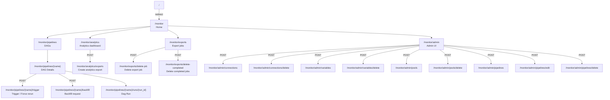
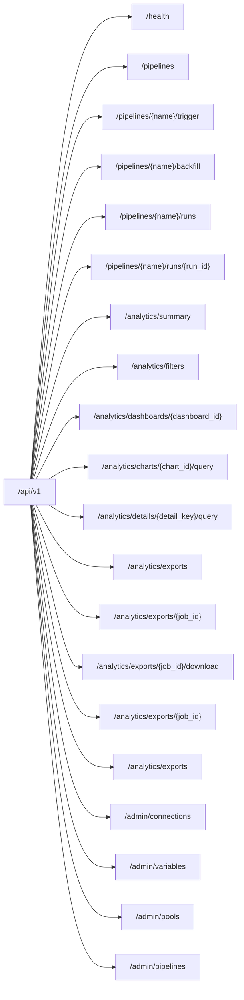

# Web UI 메뉴 구조

> 기준: 2026-04-16 현재 구현 기준

---

## 사이드바 구조

```text
Operations
- Home                -> /monitor
- DAGs                -> /monitor/pipelines

Workspaces
- Analytics           -> /monitor/analytics
- Exports             -> /monitor/exports

Platform
- Admin               -> /monitor/admin
- API Docs            -> /docs
```

- `/` 는 `/monitor` 로 redirect 된다.
- 공통 shell 은 sidebar + breadcrumb + topbar action 구조를 공유한다.
- `Home`, `DAGs`, `Analytics`, `Exports`, `Admin` 는 모두 language query를 유지한다.

---

## 페이지 계층



---

## 브레드크럼 흐름

```text
Home

Home / DAGs

Home / DAGs / {pipeline}

Home / DAGs / {pipeline} / {run_id}

Home / Analytics

Home / Exports

Home / Admin
```

- DAG list, DAG Details, Dag Run은 모두 `DAGs` 컨텍스트로 복귀한다.
- `Exports` 는 workspace 레벨 화면으로 승격된 상태다.

---

## Web UI 페이지별 주요 기능

| 페이지 | URL | 주요 기능 |
|--------|-----|-----------|
| Home | `/monitor` | scheduler/disk/mart health, pipeline summary, latest activity |
| DAGs | `/monitor/pipelines` | pipeline 검색, latest-run 상태 필터(all/ok/warn/bad), row action trigger |
| DAG Details | `/monitor/pipelines/{name}` | overview/grid/graph/runs/tasks/details, trigger, force rerun, backfill |
| Dag Run | `/monitor/pipelines/{name}/runs/{run_id}` | task instances, events, code, details, graph view, recent runs grid |
| Analytics | `/monitor/analytics` | dashboard cards/charts/detail preview, analytics export 생성 |
| Exports | `/monitor/exports` | export job 목록, 상태 조회, 다운로드, 개별 삭제, 완료 항목 일괄 삭제 |
| Admin | `/monitor/admin` | Connection/Variable/Pool/Pipeline 생성·수정·삭제 |

---

## JSON API 엔드포인트



---

## 운영 액션 동작 규칙

- Trigger: 일반 수동 실행. 같은 `execution_date`의 성공/활성 run이 있으면 재사용할 수 있다.
- Force rerun: 같은 날짜라도 새 run을 요청한다.
- Trigger/Force rerun/Backfill 모두 동일 pipeline에 active run이 있으면 `409 Conflict` 또는 busy 안내 페이지로 거부된다.
- Backfill은 비동기 요청만 큐잉하고, 월별 child run 생성·실행은 워커가 수행한다.

---

## 미구현 또는 후속 검토

- Airflow 대비 미지원 운영 액션(`pause`, `clear`, `mark success`) 도입 여부 검토
- `T-026` 결과 평가 후 남은 Airflow UI 차이와 M5 범위 재정의
